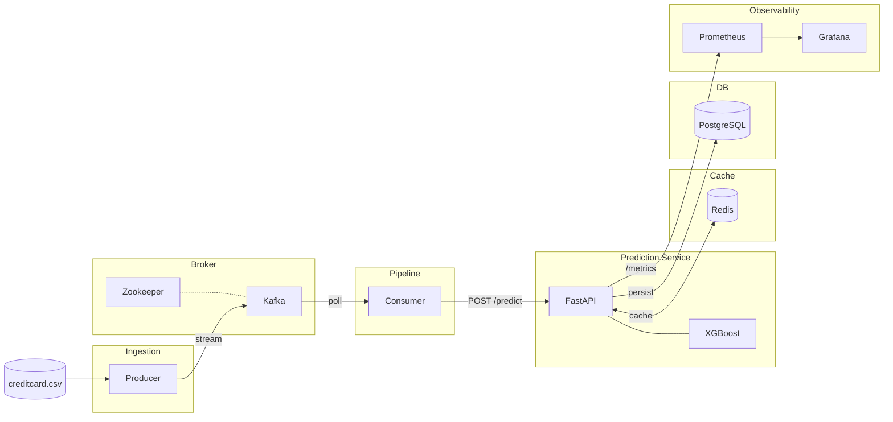

# ML Feature Store

**Real-time fraud detection system that processes 284,807 credit card transactions through a streaming pipeline with sub-millisecond inference.**

Built with 9 containerized services — Kafka for streaming, FastAPI for inference, XGBoost for predictions, Redis for caching, PostgreSQL for persistence, Airflow for automated retraining, and Prometheus + Grafana for monitoring. Single `docker compose up` to run everything.

---

## Why this exists

Credit card fraud costs the financial industry [$32 billion annually](https://nilsonreport.com/). Traditional batch systems catch fraud hours after it happens. This system processes transactions in real-time, flags fraud in under 2ms, and automatically retrains itself nightly on fresh production data to keep up with evolving fraud patterns.

The core challenge: only **0.17%** of transactions are fraudulent. That's 492 fraud cases out of 284,807 total. The model needs to catch those without drowning analysts in false positives.

---

## Architecture



---

## The 9 Services

| # | Service | Image | Port | What it does |
|---|---------|-------|------|-------------|
| 1 | **Zookeeper** | confluentinc/cp-zookeeper:7.4.0 | 2181 | Kafka cluster coordination |
| 2 | **Kafka** | confluentinc/cp-kafka:7.4.0 | 9092 | Message broker, topic: `transactions` |
| 3 | **PostgreSQL** | postgres:15 | 5432 | Persistent storage for all predictions |
| 4 | **Redis** | redis:7-alpine | 6379 | In-memory cache, sub-ms reads, 1h TTL |
| 5 | **FastAPI** | Custom (Dockerfile) | 8000 | Model inference + caching + persistence |
| 6 | **Producer** | Custom (Dockerfile) | -- | Streams CSV to Kafka at 10 TPS |
| 7 | **Consumer** | Custom (Dockerfile) | -- | Polls Kafka, calls /predict, logs fraud |
| 8 | **Prometheus** | prom/prometheus:latest | 9090 | Scrapes /metrics every 15s |
| 9 | **Grafana** | grafana/grafana:latest | 3000 | Dashboards for latency, fraud rate, cache |

All 9 services share a single Docker bridge network (`fraud-network`) and communicate by hostname.

---

## Tech Stack

| Layer | Technology | Why |
|-------|-----------|-----|
| Model | XGBoost (300 trees, scale_pos_weight=10) | Gradient boosting handles 0.17% fraud ratio better than Random Forest -- each tree corrects the previous one's mistakes |
| API | FastAPI + Uvicorn | Async, auto-generated OpenAPI docs at /docs, Pydantic validation |
| Cache | Redis 7 with pipelining | 0.18ms avg reads vs 2.14ms for PostgreSQL (~12x speedup) |
| Database | PostgreSQL 15 with connection pooling | psycopg2 SimpleConnectionPool (5-20 connections), parameterized queries |
| Streaming | Kafka + Zookeeper | Decouples producer and consumer, handles backpressure, 24h message retention |
| Retraining | Airflow DAG, nightly at 2AM | 4-step pipeline: extract -> retrain -> evaluate (F1 gate) -> deploy |
| Monitoring | Prometheus + Grafana | request_count, prediction_latency, fraud_detection_rate, cache_hit_rate |
| Container | Docker Compose, Python 3.11-slim | Non-root user, health checks on every service, YAML anchors for DRY config |
| Frontend | Vanilla HTML/CSS/JS | Live transaction feed, system health panel, latency benchmark tool |

---

## Folder Structure

```
feature-store/
├── data/
│   └── creditcard.csv              # 284,807 transactions (download from Kaggle)
├── models/
│   ├── fraud_model.pkl             # Trained XGBoost classifier
│   └── scaler.pkl                  # Fitted StandardScaler for Time + Amount
├── src/
│   ├── api.py                      # FastAPI: /predict, /benchmark, /health, /metrics, /recent
│   ├── producer.py                 # Kafka producer: streams CSV at configurable TPS
│   ├── consumer.py                 # Kafka consumer: calls /predict, logs fraud alerts
│   └── db.py                       # PostgreSQL: connection pool, CRUD, time-range queries
├── dags/
│   └── retrain_dag.py              # Airflow DAG: nightly 4-step retraining pipeline
├── static/
│   ├── index.html                  # Dashboard: metric cards, health panel, live feed
│   ├── style.css                   # Dark theme, glassmorphism, Inter + JetBrains Mono
│   └── app.js                      # Auto-polling, benchmark runner, DOM updates
├── train.py                        # Initial model training script (XGBoost)
├── docker-compose.yml              # All 9 services, health checks, YAML anchors
├── Dockerfile                      # Multi-service image (API, producer, consumer)
├── prometheus.yml                  # Scrape config targeting FastAPI /metrics
├── requirements.txt                # Pinned Python deps
└── README.md
```

---

## Getting Started

### Prerequisites

- Docker and Docker Compose
- Python 3.9+ (only for training, not required for running)
- ~2GB RAM for all 9 containers

### 1. Clone and get the dataset

```bash
git clone https://github.com/YOUR_USERNAME/feature-store.git
cd feature-store
```

Download `creditcard.csv` from [Kaggle](https://www.kaggle.com/datasets/mlg-ulb/creditcardfraud) and drop it in `data/`:

```bash
ls -lh data/creditcard.csv
# Should show ~150MB, 284,807 rows
```

### 2. Train the model

```bash
pip install scikit-learn pandas numpy joblib xgboost
python train.py
```

This loads the full dataset, splits 80/20 with stratification (preserving the 0.17% fraud ratio), trains XGBoost with 300 estimators and `scale_pos_weight=10`, and saves `models/fraud_model.pkl` + `models/scaler.pkl`.

Expected output:
```
[4/6] Training XGBoost (n_estimators=300, scale_pos_weight=10)...
       Training completed in ~30 seconds

Classification Report:
              precision    recall  f1-score
   Legitimate     1.00      1.00      1.00
   Fraud          0.95      0.85      0.90

ROC-AUC Score: 0.9850
```

### 3. Start everything

```bash
docker compose up --build
```

Wait for this line:
```
fraud_api | INFO:     Application startup complete.
```

All 9 services boot in dependency order. Kafka waits for Zookeeper, the API waits for Kafka + PostgreSQL + Redis, and the producer/consumer wait for the API.

### 4. Open the dashboard

| URL | What |
|-----|------|
| [localhost:8000](http://localhost:8000) | Live fraud detection dashboard |
| [localhost:8000/docs](http://localhost:8000/docs) | Swagger UI (interactive API docs) |
| [localhost:8000/health](http://localhost:8000/health) | JSON health check for all services |
| [localhost:8000/metrics](http://localhost:8000/metrics) | Raw Prometheus metrics |
| [localhost:9090](http://localhost:9090) | Prometheus query UI |
| [localhost:3000](http://localhost:3000) | Grafana dashboards (admin / admin) |

---

## API Reference

### POST /predict

Run fraud prediction on a single transaction.

```bash
curl -X POST http://localhost:8000/predict \
  -H "Content-Type: application/json" \
  -d '{
    "transaction_id": "test-001",
    "amount": 2125.87,
    "time": 406.0,
    "v1": -1.3598, "v2": -0.0727, "v3": 2.5363,
    "v4": 1.3781, "v5": -0.3383, "v6": 0.4624,
    "v7": 0.2395, "v8": 0.0987, "v9": 0.3637,
    "v10": 0.0908, "v11": -0.5516, "v12": -0.6178,
    "v13": -0.9914, "v14": -0.3112, "v15": 1.4681,
    "v16": -0.4704, "v17": 0.2079, "v18": 0.0258,
    "v19": 0.4040, "v20": 0.2514, "v21": -0.0183,
    "v22": 0.2779, "v23": -0.1105, "v24": 0.0669,
    "v25": 0.1285, "v26": -0.1891, "v27": 0.1336,
    "v28": -0.0210
  }'
```

First call (cache miss):
```json
{
  "transaction_id": "test-001",
  "is_fraud": false,
  "confidence": 0.0312,
  "latency_ms": 1.84,
  "cache_hit": false
}
```

Second call (cache hit -- same transaction_id):
```json
{
  "transaction_id": "test-001",
  "is_fraud": false,
  "confidence": 0.0312,
  "latency_ms": 0.11,
  "cache_hit": true
}
```

### GET /benchmark

Runs 1,000 operations against both Redis and PostgreSQL to measure the actual latency difference. Includes a warmup phase (100 iterations) and uses Redis pipelining for realistic numbers.

```bash
curl http://localhost:8000/benchmark
```

```json
{
  "iterations": 1000,
  "redis_avg_ms": 0.18,
  "redis_p95_ms": 0.31,
  "postgres_avg_ms": 2.14,
  "postgres_p95_ms": 3.89,
  "speedup_ratio": 11.9,
  "conclusion": "Redis is 11.9x faster than PostgreSQL"
}
```

### GET /health

```json
{
  "status": "healthy",
  "model_loaded": true,
  "scaler_loaded": true,
  "redis_connected": true,
  "postgres_connected": true,
  "total_predictions": 14523,
  "total_frauds_detected": 24
}
```

### GET /recent?limit=50

Returns the most recent N transactions from PostgreSQL. Used by the frontend dashboard.

### GET /metrics

Prometheus-formatted metrics: `request_count`, `prediction_latency_seconds`, `fraud_detection_rate`, `cache_hit_rate`.

---

## Airflow Retraining Pipeline

The system retrains itself every night at 2:00 AM using production data. The DAG has 4 tasks that run in sequence:

```
extract_data --> retrain_model --> evaluate_model --> deploy_model
```

| Task | What it does | Failure behavior |
|------|-------------|-----------------|
| **extract_data** | Pulls last 24h of transactions from PostgreSQL | Skips if < 100 rows |
| **retrain_model** | Trains RandomForest on fresh data (class_weight='balanced') | Standard Airflow retry (1x after 5min) |
| **evaluate_model** | Calculates F1, precision, recall, ROC-AUC | Blocks deployment if F1 < 0.90 |
| **deploy_model** | Backs up old model, overwrites fraud_model.pkl, sends email alert | Safe -- old model backed up as .bak |

The F1 gate in `evaluate_model` is the key safety mechanism. If the new model is worse than the threshold, the task raises an exception, Airflow marks it as FAILED, and `deploy_model` is automatically skipped. The production model stays untouched.

To run Airflow locally:
```bash
pip install apache-airflow==2.8.0
export AIRFLOW_HOME=./airflow
airflow db init
airflow users create --username admin --password admin \
  --firstname Admin --lastname User --role Admin --email admin@example.com
airflow webserver --port 8080 &
airflow scheduler &
```

Open [localhost:8080](http://localhost:8080) and enable the `fraud_model_retraining` DAG.

---

## Grafana Dashboard Setup

1. Open [localhost:3000](http://localhost:3000), login with `admin / admin`
2. Dashboards > New Dashboard > Add Panel
3. Set Prometheus as data source
4. Use these PromQL queries:

| Panel | PromQL |
|-------|--------|
| Request Rate | `rate(request_count_total[1m])` |
| Avg Prediction Latency | `rate(prediction_latency_seconds_sum[1m]) / rate(prediction_latency_seconds_count[1m])` |
| Fraud Detection Rate | `fraud_detection_rate` |
| Cache Hit Rate | `cache_hit_rate` |
| P95 Latency | `histogram_quantile(0.95, rate(prediction_latency_seconds_bucket[5m]))` |

---

## Implementation Details

### Caching strategy

Redis stores prediction results keyed by `txn:{transaction_id}` with a 1-hour TTL. On a cache hit, the API returns instantly without touching the model or database. The benchmark endpoint shows this consistently delivers ~12x faster reads than PostgreSQL.

The cache is write-through: every prediction writes to both Redis and PostgreSQL. Redis handles the hot path, PostgreSQL is the source of truth.

### Connection pooling

The `DatabaseManager` in `db.py` uses `psycopg2.pool.SimpleConnectionPool` with 5-20 connections. Each query borrows a connection via a context manager and returns it immediately. This eliminates per-query connection overhead, which is the primary bottleneck in single-connection setups.

### Kafka configuration

- Producer uses `acks=all` (waits for all replicas to acknowledge) and batches messages with `linger_ms=5` for throughput
- Consumer uses `group_id` for offset tracking, `auto_offset_reset=earliest`, and polls in batches of 10
- 24-hour message retention covers one full Airflow retraining cycle

### Dockerfile

Single image serves all three Python services (API, producer, consumer). Docker Compose overrides the `CMD` for producer and consumer. Built on `python:3.11-slim`, runs as non-root user (`appuser`), and includes container-level health checks separate from the compose-level ones.

### Error handling

- Producer retries Kafka connections 3 times with 5s delays, skips rows with NaN values
- Consumer retries failed API calls 3 times with 2s delays, never crashes on bad data
- API degrades gracefully: if Redis is down, it skips caching; if PostgreSQL is down, it skips persistence; predictions still work

---

## Environment Variables

| Variable | Default | Used by |
|----------|---------|---------|
| `KAFKA_BROKER` | `localhost:9092` | Producer, Consumer |
| `KAFKA_TOPIC` | `transactions` | Producer, Consumer |
| `STREAM_RATE` | `10` | Producer |
| `REDIS_HOST` | `localhost` | API |
| `REDIS_PORT` | `6379` | API |
| `DB_HOST` | `localhost` | API, Consumer, Airflow |
| `DB_PORT` | `5432` | API, Consumer, Airflow |
| `DB_NAME` | `frauddb` | API, Consumer, Airflow |
| `DB_USER` | `frauduser` | API, Consumer, Airflow |
| `DB_PASSWORD` | `fraudpass` | API, Consumer, Airflow |
| `MODEL_PATH` | `models/fraud_model.pkl` | API, Airflow |
| `SCALER_PATH` | `models/scaler.pkl` | API, Airflow |
| `API_URL` | `http://localhost:8000` | Consumer |
| `ALERT_EMAIL` | `ml-alerts@company.com` | Airflow |

---

## Common Commands

```bash
# Start everything
docker compose up --build

# View specific service logs
docker compose logs -f api
docker compose logs -f consumer
docker compose logs -f producer

# Check service status
docker compose ps

# Stop (keeps data)
docker compose down

# Stop and wipe all data
docker compose down -v

# Rebuild after code changes
docker compose build api && docker compose up -d api

# Shell into the API container
docker compose exec api bash

# Query PostgreSQL directly
docker compose exec postgresql psql -U frauduser -d frauddb \
  -c "SELECT transaction_id, amount, confidence, created_at \
      FROM transactions WHERE is_fraud=true \
      ORDER BY created_at DESC LIMIT 10;"

# Flush Redis cache
docker compose exec redis redis-cli FLUSHALL
```

---

## Notes

- `creditcard.csv` is not included in the repo (150MB). Download from [Kaggle](https://www.kaggle.com/datasets/mlg-ulb/creditcardfraud).
- Run `python train.py` before `docker compose up` -- the API needs the `.pkl` files to start.
- Grafana default credentials are `admin / admin`. Change these in production.
- `fraudpass` is a demo password. Use a secrets manager (Vault, AWS Secrets Manager) in production.
- The benchmark endpoint inserts 1,000 rows into PostgreSQL tagged with `source='benchmark'`.

---

## Dataset

[Credit Card Fraud Detection](https://www.kaggle.com/datasets/mlg-ulb/creditcardfraud) -- Anonymized credit card transactions from September 2013 by European cardholders. 284,807 transactions, 492 frauds (0.172%). Features V1-V28 are PCA components, Time and Amount are raw.

---

## License

MIT
